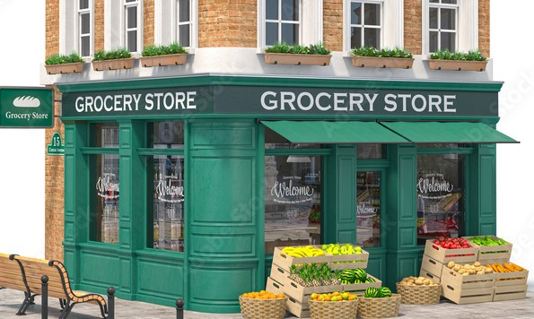

# Retail_Sales_Analysis

# Table of Contents
- [Introduction](#introduction)
- [Business Problem](#business-problem)
- [Data Source](#data-source)
- [Method of Analysis](#method-of-analysis)
- [Tools](#tools)
- [Graphs for EDA](#graphs-for-eda)
- [Summary of Findings](#summary-of-findings)
- [Recommendations](#recommendations)
- [Code](#code)
- [Dashboard](#dashboard)
- [Reference](#reference)
# Introduction
This was a project I worked on for a  retail store (The name is withheld for the sake of anonymity). I approached the owner of the store, discussed with and offered to solve any business problem they might be facing, and they were willing to provide some internal data that could be used to carry out the analysis.
# Business Problem
How do we increase sales performance?
# Data Source
The data was provided by the stakeholder who is the owner of the retail store. It includes well detailed sales record of the store, spanning July to December. I carried out data entry into Microsoft Excel and arranged them into rows and columns, then loaded it as a csv file. The data contains two tables, the first table has 186 rows and 5 columns while the second table has 90 rows and 3 columns.
# Method of Analysis
* Loaded the data into Excel
* Cleaned and transformed the data by changing data types and ensuring consistent format
* Imported data from Excel to a SQL server(PostgreSQL)
* Removed rows with null values irrelvant to the analysis
* Constructed queries to analyse and obtain findings from the data
* Exported the data in order to visualize and further analyse in Tableau
* Created a dashboard to visualize the results and findings
# Tools
* Excel
* SQL(PostgreSQL)
* [Tableau](https://public.tableau.com/app/profile/joy.johnson5229/viz/Retail_Sales_Analysis_16959781305710/Dashboard1)
# Graphs for EDA
Exploratory Data Analysis(EDA) involves exploring the sales data to answer key questions such as:

- What does the Month on Month(M-o-M) sales growth look like?
.png)

- What is the overall sales trend?
.png)

- Which products are top sellers?
.png)

# Summary of Findings
There was a downward slope in the monthly sales growth from September to December. Findings were conducted and I discovered that there was an upsurge in competition around the store area during that period, this led to decrease in customers as well as low sales. Also, Beans was the highest selling product that yielded more profit in terms of sale and revenue.
# Recommendations
* Focus on customer retention and employ marketing strategies such as offering incentives like discounts to arouse their interest
* Conduct customer survey and utilise feeback to improve consumer satisfaction as well as sales performance
* Stock products that yielded more profits and were higher in demands
# Code
You can explore the code [here](https://github.com/johyexson/Retail_Sales_Analysis/blob/main/Retail_Sales_Analysis.sql)
# Dashboard
You can view the dashboard I created in Tableau [here](https://public.tableau.com/app/profile/joy.johnson5229/viz/Retail_Sales_Analysis_16959781305710/Dashboard1)
# Reference
 - [Stack Overflow](https://stackoverflow.com/)
